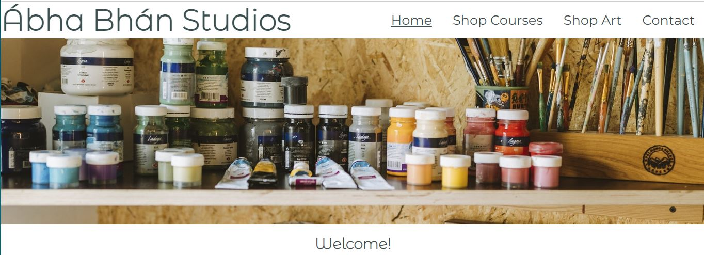
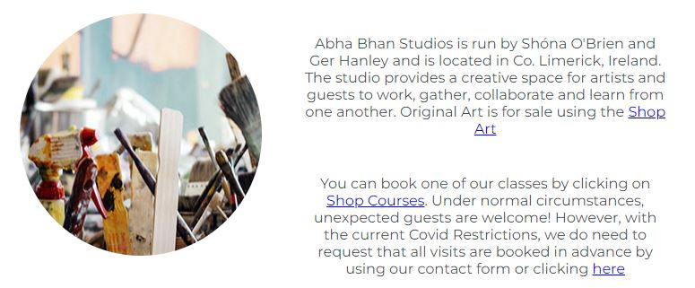
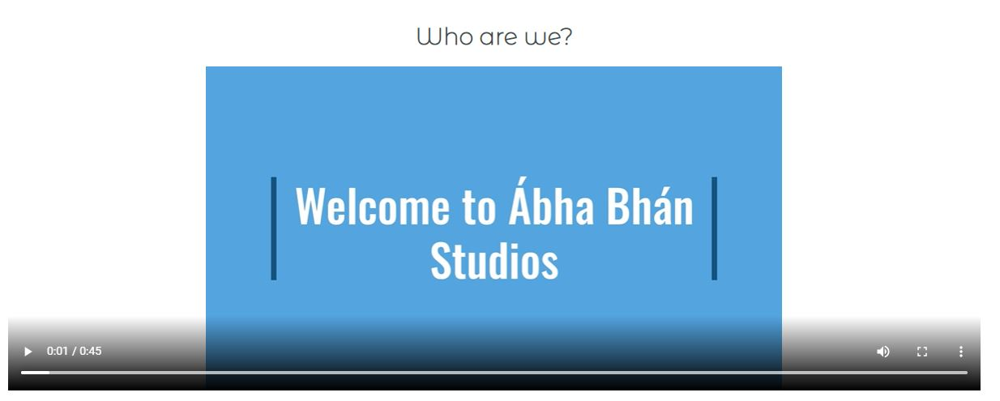
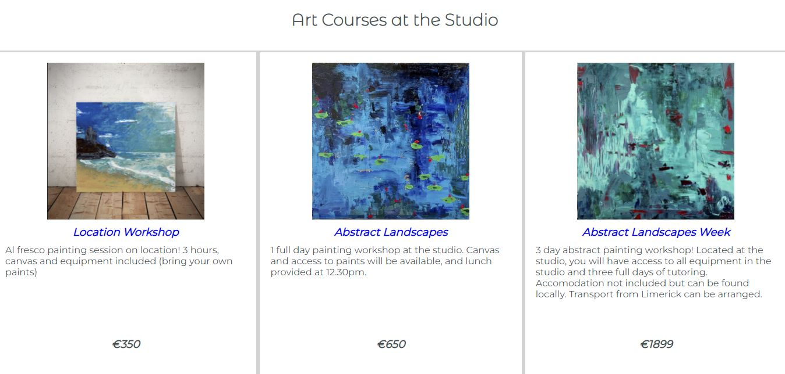

ABHA BHAN STUDIOS (LOGO)

<h2>Welcome to the Abha Bhan Studios README document.</h2> 

Abha Bhan Studios is a business that offers courses as well as original artworks for sale. The aim of the website is to provide a platform on which to market and ultimately sell the courses on offer as well as the original artworks. 

The website will target potential clients who may wish to find out more about the courses on offer, as well as those who wish to buy original artworks. Clients will be able to view the upcoming available courses, book a slot on those courses and also view and express interest in the available artworks.
 

The scope of this project is to build the site functionality and allow it to launch with capacity to take bookings and orders via contact form. The e-commerce platform will be part of another project in the future when the scope will include this work. 

<h2>Features</h2>

There are several features included in this initial scope project for Abha Bhan Studios; these features are intended to bring a level of information to the client, and a seamless contact facility for the business. 

<h3>Features included in this project:</h3>
<ul>
    <li>Landing Page including "about us" video and introduction paragraph</li>
    <li>Navigation Bar - including "Shop Courses", "Shop Artwork" and "Contact Us" navigation links, in order of priority.</li>
    <li>Shop Courses Page - to allow clients to view available courses and pricing, and to make contact about one of those courses should they wish to book. </li>
    <li>Shop Artworks Page - to allow clients to view available artworks and pricing, and to make contact should they wish to make a purchase.</li>
    <li>Contact Form - to gather data for the business from the potential clients</li>
</ul>

<h3>Landing Page</h3>

The landing page includes a header image showing a close up of the studio workshop. This page is intended to introduce Abha Bhan Studios to the clients and provide a welcome message, some basic information about the business and an informative video. The video has not been set to "autoplay" for UX purposes, and to allow the client to control the interaction. 

The landing page also includes a Welcome Message and an interactive video introducing the client to the business. 

<h3>Shop Courses</h3>

The Shop Courses page is designed to show the client the available courses from Abha Bhan Studios. The courses are structured in column format which is designed to be responsive to various screen sizes; for example, on a laptop it will show three columns across. On a mobile device it will show one column across.

This layout is designed to showcase the course header images which relate to each course available. Each course title is an active link which - for the scope of this project - will bring the client to the contact form to make an enquiry. *We believe that in the next project scope, this will be converted to an "add to cart" feature to allow the clients to book and pay online, therefore reducing the risk of "non-completion" of booking.

